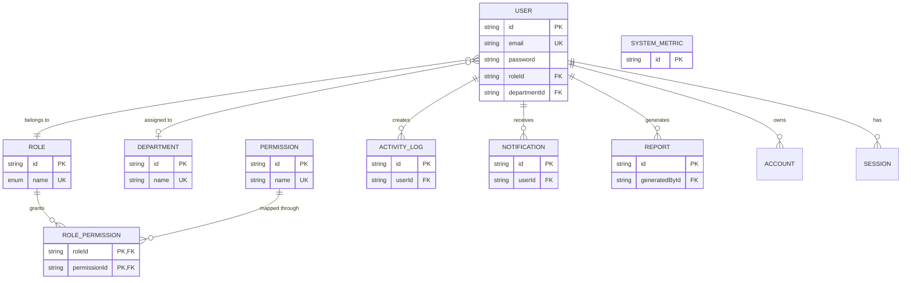

# SynapseOS PostgreSQL Architecture

## ER Diagram Explanation

## Relationship Explanation

- `User -> Role` is many-to-one. Every user must belong to exactly one role, which centralizes access logic.
- `User -> Department` is optional many-to-one. This supports shared departments without duplicating department metadata.
- `Role <-> Permission` is many-to-many through `RolePermission`, using a composite primary key to prevent duplicate mappings.
- `User -> ActivityLog`, `User -> Notification`, and `User -> Report` are one-to-many relations that separate operational history from identity data.
- `Account`, `Session`, and `VerificationToken` preserve Auth.js compatibility and remain isolated from business-domain tables.

## Normalization Explanation

- **1NF**: Every table stores atomic values only. No multi-value columns or repeated groups are present.
- **2NF**: Tables with composite identifiers, especially `RolePermission`, have non-key attributes that depend on the entire composite key.
- **3NF**: Descriptive data is stored in its owning entity only. For example:
  - Role descriptions live in `Role`, not in `User`.
  - Department descriptions live in `Department`, not in `User`.
  - Permission metadata lives in `Permission`, not in `RolePermission`.
  - Report status is stored in `Report`, while user identity remains in `User`.

This keeps the schema highly normalized and reduces update anomalies.

## Constraint Explanation

- Primary keys exist on every table for entity integrity.
- Foreign keys enforce valid relations between users, roles, departments, permissions, reports, and notifications.
- Composite primary key on `RolePermission` guarantees one unique role-permission pair.
- Unique constraints on `User.email`, `Role.name`, `Permission.name`, and `Department.name` prevent duplicate business identities.
- Enums are used for `Role.name` and `Report.status` to constrain valid values.
- Cascading rules are chosen intentionally:
  - `RolePermission`, `Account`, `Session`, and `Notification` use cascade rules where child rows should never outlive the parent.
  - `ActivityLog` and `Report` use `SetNull` to preserve audit and reporting records even if the source user is removed.
  - `User -> Role` uses `Restrict` to avoid deleting active roles accidentally.

## Indexing Explanation

- `User` indexes on `roleId`, `departmentId`, `status`, and `createdAt` support admin filtering, onboarding, and audit screens.
- `ActivityLog(userId, createdAt)` accelerates recent-user-activity lookups.
- `Notification(userId, isRead, createdAt)` supports unread inbox retrieval efficiently.
- `Report(generatedById, status)` helps manager/admin report queries.
- `SystemMetric(createdAt)` supports time-series metric reads.
- `RolePermission(permissionId)` improves reverse permission lookups for RBAC analysis.
- Auth.js tables keep indexes aligned to user/session access paths.

## Query Optimization Considerations

- The schema separates write-heavy audit tables from frequently-read identity tables to reduce contention.
- Narrow unique business keys (`email`, `name`) keep lookups selective.
- Junction-table design prevents permission duplication and simplifies RBAC joins.
- Time-ordered indexes support dashboard recency queries and future archival strategies.
- Decimal types for system metrics preserve precision for infrastructure analytics.
